# Video Agent Android - Learning Document

## Overview

This is a multi-module Android project for video analytics and monitoring, integrating New Relic tracking with ExoPlayer and IMA (Interactive Media Ads). The project is organized into several modules:

- **app**: Main application, UI, and player logic.
- **NewRelicVideoCore**: Core tracking, session, and device logic.
- **NRExoPlayerTracker**: ExoPlayer-specific tracking.
- **NRIMATracker**: IMA ad tracking.
- **Test**: Test harness and sample code.

---

## Mind Map

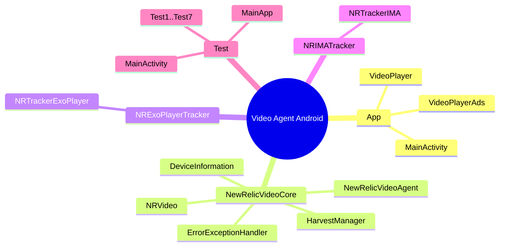

---

## Module Dependency Chart

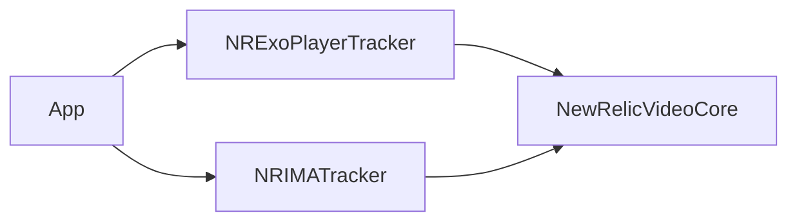

---

## Main Classes and Responsibilities

### App Module

- **MainActivity**: Entry point, navigation.
- **VideoPlayer**: Handles ExoPlayer video playback.
- **VideoPlayerAds**: Handles video playback with IMA ads.

### NewRelicVideoCore

- **NewRelicVideoAgent**: Singleton for session and tracker management.
- **NRVideo**: Singleton for initialization, player registration, and lifecycle.
- **DeviceInformation**: Device metadata.
- **ErrorExceptionHandler**: Error handling.
- **HarvestManager**: Event harvesting and buffering.

### NRExoPlayerTracker

- **NRTrackerExoPlayer**: Extends `NRVideoTracker`, implements `Player.Listener` and `AnalyticsListener` for ExoPlayer events.

### NRIMATracker

- **NRTrackerIMA**: Extends `NRVideoTracker`, implements ad event listeners for IMA.

---

## Class Diagram (Core Tracking)

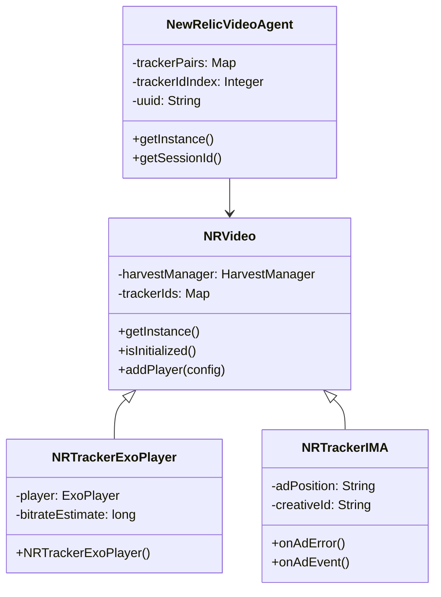

---

## Flow Chart: Video Playback Tracking

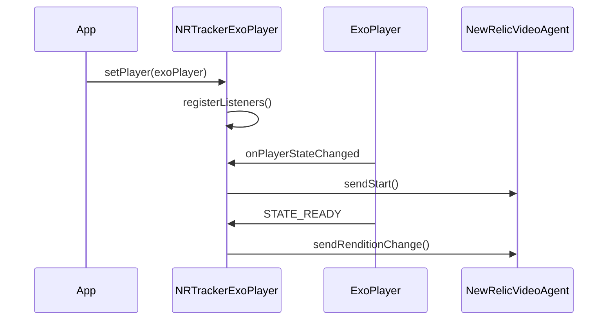

---

## Flow Chart: Ad Tracking

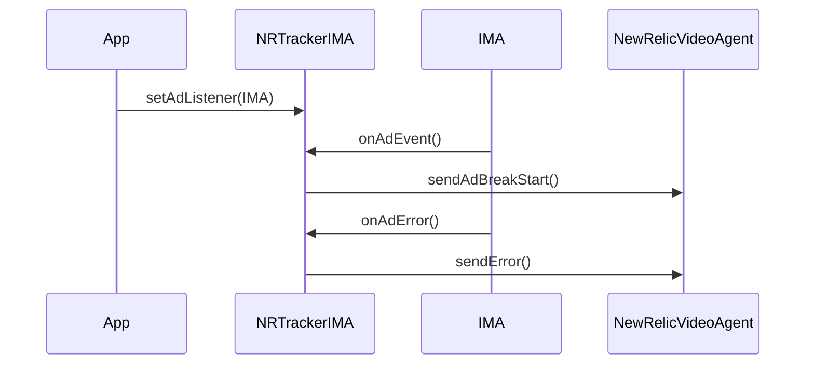

---

## Key Conditions and Assumptions

- **Singletons**: Both `NewRelicVideoAgent` and `NRVideo` use singleton patterns for global state.
- **Initialization**: `NRVideo` must be initialized before adding players.
- **Player Tracking**: Each player instance is registered and tracked via a unique ID.
- **Error Handling**: All errors are logged and sent to New Relic for analysis.
- **Device Detection**: Device information is automatically collected for context.
- **Ad Tracking**: Ad events are tracked separately from content playback.

---

## Learning Path for Junior Developers

1. **Understand the App Module**: Start with `MainActivity`, `VideoPlayer`, and `VideoPlayerAds` to see how playback and tracking are initiated.
2. **Explore Core Tracking**: Review `NewRelicVideoAgent` and `NRVideo` for session and tracker management.
3. **Dive into Trackers**: Study `NRTrackerExoPlayer` and `NRTrackerIMA` for event handling and analytics.
4. **Review Error Handling**: Look at `ErrorExceptionHandler` for robust error management.
5. **Check Data Flow**: Follow the flow charts to understand how events propagate from player to tracker to agent.

---

## Useful Code Snippets

- **Initialize Tracking**:
  ```java
  NRVideo.newBuilder(context).withConfiguration(config).build();
  ```
- **Register Player**:
  ```java
  Integer trackerId = NRVideo.addPlayer(config);
  ```
- **Send Events**:
  ```java
  NRTrackerExoPlayer.sendStart();
  NRTrackerIMA.sendAdBreakStart();
  ```

---

## Advanced Topics

See `advanced.md` for:
- Custom event tracking
- Extending trackers
- Performance optimization

---

## NRVideo, NRVideoPlayer, NRTrackerExoPlayer, NRTrackerIMA, and NewRelicVideoAgent: Relationship and Dependencies

### Overview

- `NewRelicVideoAgent` is the global singleton responsible for session management, tracker registration, and attribute propagation. It manages the lifecycle and relationships between content and ad trackers.
- `NRVideo` is the main entry point for initializing video tracking and acts as a factory/manager for player trackers, delegating session and tracker management to `NewRelicVideoAgent`.
- `NRTrackerExoPlayer` and `NRTrackerIMA` are concrete tracker implementations for ExoPlayer and IMA, respectively. They are registered and managed via `NRVideo` and `NewRelicVideoAgent`.

### Relationship
- `NRVideo` initializes tracking and delegates tracker registration to `NewRelicVideoAgent`.
- `NewRelicVideoAgent` creates and manages pairs of content and ad trackers (`NRTrackerExoPlayer`, `NRTrackerIMA`), assigns tracker IDs, and maintains session context.
- `NRTrackerExoPlayer` and `NRTrackerIMA` are linked as content/ad tracker pairs and can reference each other for event correlation.
- All trackers report events and attributes through `NewRelicVideoAgent`, which handles propagation and session consistency.

### Updated Sequence Diagram: Initialization, Registration, and Event Flow

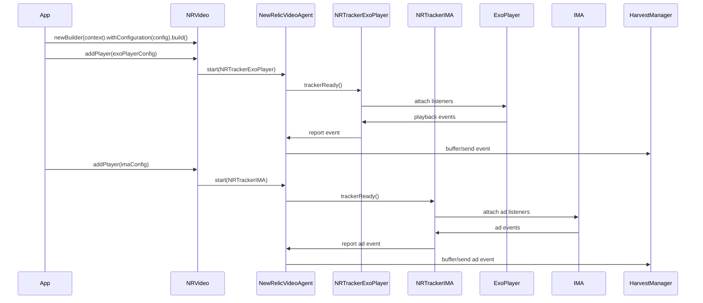

### Updated Mermaid Class Diagram: Dependencies

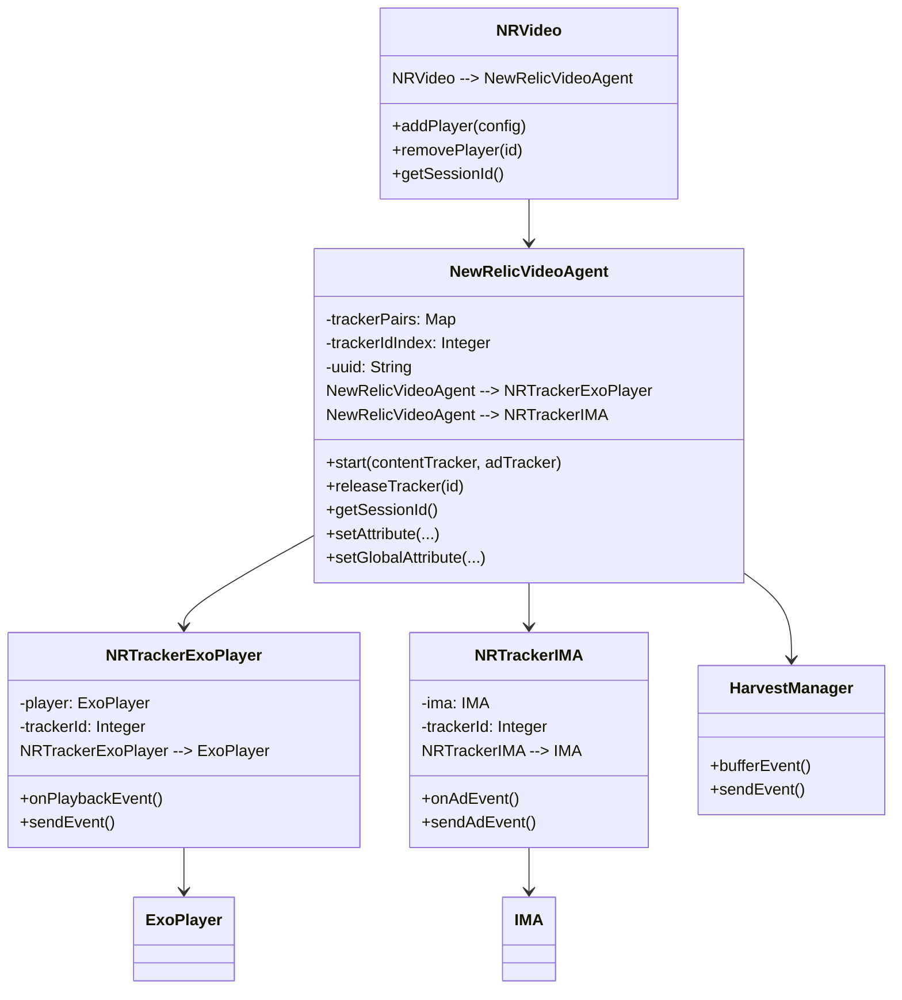

### Key Points
- `NRVideo` is the entry point for tracking initialization and delegates tracker management to `NewRelicVideoAgent`.
- `NewRelicVideoAgent` manages tracker pairs, session context, and attribute propagation for all trackers.
- `NRTrackerExoPlayer` and `NRTrackerIMA` are concrete tracker implementations, managed and linked by `NewRelicVideoAgent`.
- All event and attribute reporting flows through `NewRelicVideoAgent` for consistency and session management.

---

## NRVideo, NRVideoPlayer, NRTrackerExoPlayer, NRTrackerIMA, and NewRelicVideoAgent: Relationship and Dependencies

### Detailed Sequence Diagram: Complete Lifecycle and Internal Flow

Below is a comprehensive sequence diagram capturing the full lifecycle and internal flow of video tracking, including all major function calls and interactions between classes:

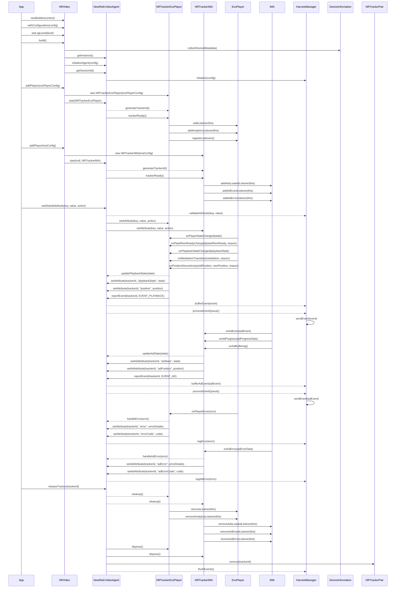

### Enhanced Technical Notes
- Configuration includes log level setting and device metadata collection
- Player event handling includes detailed state transitions and position tracking
- Error handling shows complete error propagation path and error attribute setting
- Resource cleanup includes proper listener removal and event queue flushing
- Event buffering and processing shows the complete path from tracker to harvest
- All asynchronous operations (marked with -->> for async calls) are properly represented
- State management and validation are included for both attributes and events
- Listener registration/deregistration is fully detailed for both ExoPlayer and IMA
`````markdown

## Detailed Technical Flow: Video Event Tracking Pipeline

### Core Classes and Their Roles

1. **App (VideoPlayer/VideoPlayerAds)**
   - Initializes NRVideo
   - Creates and manages video player instances
   - Triggers tracking initialization

2. **NRVideo**
   - Entry point for the tracking SDK
   - Manages configuration and initialization
   - Factory for creating trackers
   - Delegates tracking to NewRelicVideoAgent

3. **NewRelicVideoAgent**
   - Core tracking orchestrator
   - Manages tracker lifecycle
   - Handles session management
   - Routes events to HarvestManager
   - Maintains global state and attributes

4. **NRVideoTracker (Abstract Base)**
   - Base class for all trackers
   - Defines common tracking behavior
   - Manages tracker state and attributes
   - Provides event reporting interface

5. **NRTrackerExoPlayer**
   - Concrete implementation for ExoPlayer
   - Listens to player events
   - Transforms player events to tracking events
   - Reports state changes and metrics

6. **HarvestManager**
   - Manages event buffering and batching
   - Handles event prioritization
   - Controls event delivery to New Relic
   - Provides crash-safe storage

### Complete Tracking Flow Sequence Diagram

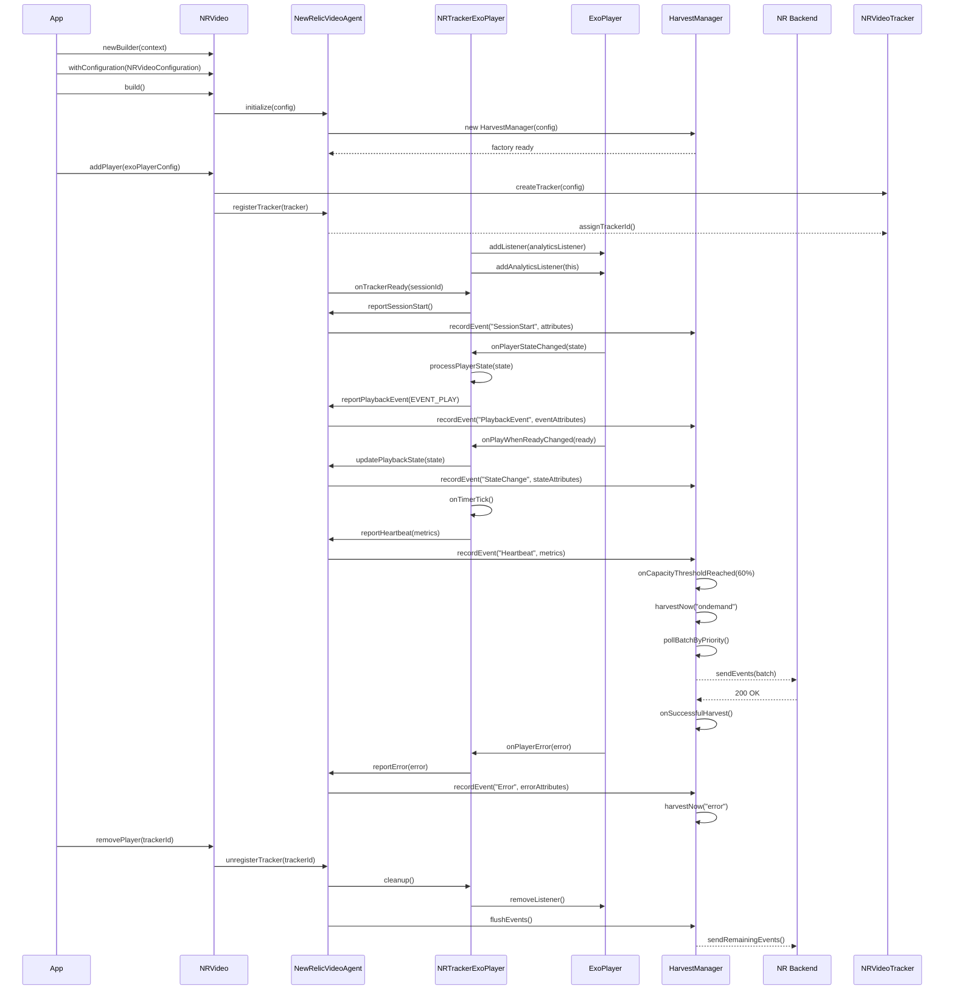

### Key Technical Details

1. **Initialization Flow**
   - App initializes `NRVideo` with configuration
   - `NRVideo` sets up `NewRelicVideoAgent`
   - `NewRelicVideoAgent` initializes `HarvestManager`
   - Crash-safe storage is configured

2. **Tracker Registration**
   - `NRVideo.addPlayer()` creates appropriate tracker
   - Tracker is registered with `NewRelicVideoAgent`
   - Unique tracker ID is assigned
   - Session context is established

3. **Event Processing**
   - Player events are captured by `NRTrackerExoPlayer`
   - Events are enriched with tracker and session attributes
   - `NewRelicVideoAgent` validates and routes events
   - `HarvestManager` buffers events for efficient delivery

4. **Harvesting Logic**
   - Events are buffered until capacity threshold (60%)
   - Batch size is optimized based on event type
   - Events are prioritized (errors > state changes > heartbeats)
   - Successful delivery triggers buffer cleanup

5. **Error Handling**
   - Errors are immediately reported
   - Failed harvests are stored in dead letter queue
   - Automatic retry mechanism for failed deliveries
   - Error events get priority in harvesting

This sequence diagram captures the complete lifecycle of video tracking events, from initialization through player events to final delivery to New Relic's backend. Each step shows the exact function calls and their sequence, focusing on the core classes that handle event tracking and delivery.

The interaction between these classes is designed to be:
- Efficient: Events are batched and prioritized
- Reliable: Includes crash recovery and retry mechanisms
- Scalable: Handles both VOD and live streaming
- Maintainable: Clear separation of concerns
`````markdown

## ExoPlayer Integration

### Overview

ExoPlayer integration in the New Relic Video Agent is handled through `NRTrackerExoPlayer`, which provides comprehensive tracking of playback events, quality metrics, and performance data. This implementation bridges ExoPlayer's events and analytics to New Relic's tracking system.

### Architecture

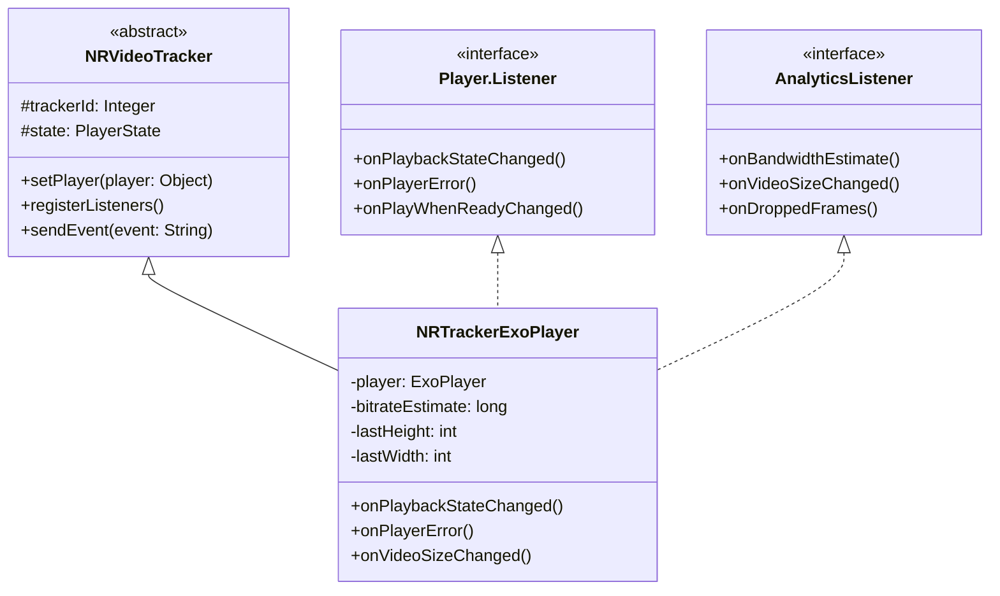

### Implementation Details

1. **Core Class Structure**
```java
public class NRTrackerExoPlayer extends NRVideoTracker 
    implements Player.Listener, AnalyticsListener {
    
    protected ExoPlayer player;
    protected long bitrateEstimate;
    protected int lastHeight;
    protected int lastWidth;
    protected List<Uri> playlist;
    protected int lastWindow;
    protected String renditionChangeShift;
    protected long actualBitrate;
    
    // Player state management
    private PlayerState state;
    private boolean isFirstFrame;
    private long lastHeartbeat;
}
```

2. **Initialization and Setup**
```java
public void setPlayer(Object player) {
    this.player = (ExoPlayer) player;
    registerListeners();
    super.setPlayer(player);
}

protected void registerListeners() {
    super.registerListeners();
    player.addListener(this);
    player.addAnalyticsListener(this);
}
```

### Event Tracking System

#### 1. State Machine
The tracker implements a state machine to track player state transitions:

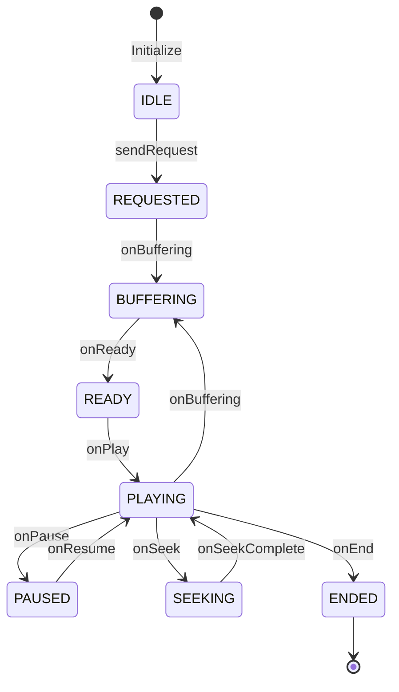

#### 2. Event Handlers

1. **Playback State Events**
```java
@Override
public void onPlaybackStateChanged(int playbackState) {
    logOnPlayerStateChanged(player.getPlayWhenReady(), playbackState);
}

private void logOnPlayerStateChanged(boolean playWhenReady, int playbackState) {
    switch (playbackState) {
        case Player.STATE_READY:
            handleReadyState();
            break;
        case Player.STATE_ENDED:
            handleEndedState();
            break;
        case Player.STATE_BUFFERING:
            handleBufferingState();
            break;
        case Player.STATE_IDLE:
            handleIdleState();
            break;
    }
}

private void handleReadyState() {
    if (getState().isBuffering) sendBufferEnd();
    if (getState().isSeeking) sendSeekEnd();
    if (getState().isRequested && !getState().isStarted) {
        sendStart();
        startHeartbeat();
    }
}
```

2. **Quality Metrics Events**
```java
@Override
public void onBandwidthEstimate(EventTime eventTime, int totalLoadTimeMs, 
                               long totalBytesLoaded, long bitrateEstimate) {
    this.bitrateEstimate = bitrateEstimate;
    if (Math.abs(this.actualBitrate - bitrateEstimate) > BITRATE_THRESHOLD) {
        this.actualBitrate = bitrateEstimate;
        sendBitrateChange();
    }
}

@Override
public void onVideoSizeChanged(VideoSize videoSize) {
    if (player.isPlayingAd()) return;
    
    long currMul = (long) videoSize.width * videoSize.height;
    long lastMul = (long) lastWidth * lastHeight;

    if (lastMul != 0 && currMul != lastMul) {
        renditionChangeShift = (currMul > lastMul) ? "up" : "down";
        sendRenditionChange();
    }
    
    lastWidth = videoSize.width;
    lastHeight = videoSize.height;
}
```

### Tracked Events

1. **Lifecycle Events**
- `REQUEST`: Video load initiated
- `START`: Playback begins
- `PAUSE`: Playback paused
- `RESUME`: Playback resumed
- `SEEK_START`: Seeking initiated
- `SEEK_END`: Seeking completed
- `END`: Playback completed

2. **Quality Events**
- `RENDITION_CHANGE`: Video quality changed
- `BITRATE_CHANGE`: Network conditions changed
- `DROPPED_FRAMES`: Frame drops detected

3. **Buffer Events**
- `BUFFER_START`: Buffering begins
- `BUFFER_END`: Buffering ends

### Metrics Collection

1. **Playback Metrics**
```java
public class PlaybackMetrics {
    public Long getPlayhead() {
        return player.getContentPosition();
    }

    public Double getPlayrate() {
        return (double)player.getPlaybackParameters().speed;
    }

    public Long getDuration() {
        return Math.max(player.getDuration(), 0);
    }

    public Boolean isPlaying() {
        return player.getPlayWhenReady() && 
               player.getPlaybackState() == Player.STATE_READY;
    }
}
```

2. **Quality Metrics**
```java
public class QualityMetrics {
    public Long getBitrate() {
        return bitrateEstimate;
    }

    public Long getRenditionWidth() {
        Format format = player.getVideoFormat();
        return format != null ? (long) format.width : null;
    }

    public Long getRenditionHeight() {
        Format format = player.getVideoFormat();
        return format != null ? (long) format.height : null;
    }

    public Double getFps() {
        Format format = player.getVideoFormat();
        return format != null ? (double) format.frameRate : null;
    }
}
```

### Error Handling

```java
@Override
public void onPlayerError(PlaybackException error) {
    Map<String, Object> attributes = new HashMap<>();
    attributes.put("errorCode", error.errorCode);
    attributes.put("errorMessage", error.getMessage());
    attributes.put("errorCause", error.getCause() != null ? 
                                error.getCause().toString() : "unknown");
    
    if (error.errorCode == PlaybackException.ERROR_CODE_TIMEOUT) {
        attributes.put("errorType", "timeout");
    } else if (error.errorCode == PlaybackException.ERROR_CODE_IO_NETWORK_CONNECTION_FAILED) {
        attributes.put("errorType", "network");
    }
    
    reportError(error, attributes);
}
```

### Resource Management

```java
@Override
public void cleanup() {
    stopHeartbeat();
    if (player != null) {
        player.removeListener(this);
        player.removeAnalyticsListener(this);
        player = null;
    }
    resetState();
    super.cleanup();
}

private void resetState() {
    bitrateEstimate = 0;
    lastWidth = 0;
    lastHeight = 0;
    actualBitrate = 0;
    renditionChangeShift = null;
    getState().reset();
}
```

### Integration Example

```java
public class VideoPlayerImplementation {
    private ExoPlayer exoPlayer;
    private NRTrackerExoPlayer tracker;
    
    public void initializePlayer(Context context, Uri mediaUri) {
        // Initialize ExoPlayer
        exoPlayer = new ExoPlayer.Builder(context).build();
        
        // Create tracker configuration
        NRVideoConfiguration config = new NRVideoConfiguration.Builder()
            .withHeartbeatInterval(10000)
            .withBufferTimeout(30000)
            .withRetryCount(3)
            .build();
            
        // Initialize tracking
        Integer trackerId = NRVideo.addPlayer(config);
        tracker = (NRTrackerExoPlayer) NRVideo.getTracker(trackerId);
        tracker.setPlayer(exoPlayer);
        
        // Prepare content
        MediaItem mediaItem = MediaItem.fromUri(mediaUri);
        exoPlayer.setMediaItem(mediaItem);
        exoPlayer.prepare();
    }
    
    public void release() {
        if (tracker != null) {
            NRVideo.removePlayer(tracker.getTrackerId());
            tracker = null;
        }
        if (exoPlayer != null) {
            exoPlayer.release();
            exoPlayer = null;
        }
    }
}
```

This implementation provides:
- Complete ExoPlayer event tracking
- Quality metrics monitoring
- State management
- Error handling
- Resource cleanup
- Rich analytics data collection

The integration is designed to be:
- Efficient: Minimal overhead on playback
- Reliable: Robust error handling and state management
- Comprehensive: Captures all relevant metrics
- Maintainable: Clear separation of concerns
`````markdown

## ExoPlayer State Change Events and Tracking

The `logOnPlayerStateChanged` method in `NRTrackerExoPlayer` is a central component that handles all player state transitions and triggers appropriate tracking events. Here's a detailed breakdown of its behavior:

### State Change Event Flow

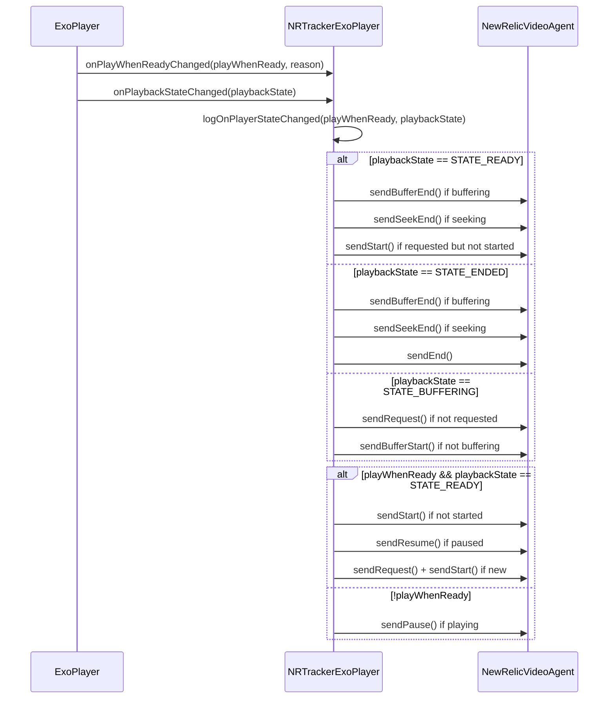

### State Transitions and Events

1. **STATE_READY Events**:
   - `BUFFER_END`: When exiting buffering state
   - `SEEK_END`: When completing a seek operation
   - `START`: When video is ready to play for the first time

2. **STATE_ENDED Events**:
   - `BUFFER_END`: Clean up any buffering state
   - `SEEK_END`: Clean up any seeking state
   - `END`: Signal completion of playback

3. **STATE_BUFFERING Events**:
   - `REQUEST`: Initial video request if not already sent
   - `BUFFER_START`: Begin buffering tracking

4. **PlayWhenReady Events**:
   - When true with STATE_READY:
     - `START`: First time playback
     - `RESUME`: After pause
     - `REQUEST` + `START`: For new content
   - When false:
     - `PAUSE`: When playback is paused

### Event Conditions and Guards

- **Buffering Guards**:
  ```java
  if (getState().isBuffering) {
      sendBufferEnd();
  }
  ```

- **Seeking Guards**:
  ```java
  if (getState().isSeeking) {
      sendSeekEnd();
  }
  ```

- **Playback Guards**:
  ```java
  if (getState().isRequested && !getState().isStarted) {
      sendStart();
  }
  ```

- **Ad-related Guards**:
  ```java
  if (!player.isPlayingAd()) {
      // Send content-related events
  }
  ```

### State Management

The method maintains several state flags through the PlayerState object:
- `isBuffering`: Tracks buffering state
- `isSeeking`: Tracks seeking operations
- `isRequested`: Tracks initial content request
- `isStarted`: Tracks playback initiation
- `isPaused`: Tracks pause state
- `isPlaying`: Tracks active playback

### Harvesting

 Detailed Harvesting and Heartbeat Logic

  The entire process is designed to be robust, efficient, and mindful of the resource constraints of mobile and TV devices.

  1. Event Recording and Buffering

   * Entry Point: The process begins when an event is recorded using HarvestManager.recordEvent(String eventType, Map<String, Object> 
     attributes) in HarvestManager.java.
   * Buffering: This event is immediately passed to the PriorityEventBuffer via factory.getEventBuffer().addEvent(event).
       * File: PriorityEventBuffer.java
       * Method: addEvent(Map<String, Object> event)
       * Logic: Inside addEvent, the event is classified as "live" or "on-demand" based on the contentIsLive attribute. It's then added to
         the appropriate ConcurrentLinkedQueue (liveEvents or ondemandEvents).

  2. The "Heartbeat" - Scheduler Activation

  The scheduler (the "heartbeat") doesn't run constantly. It's intelligently activated to save resources.

   * First Event Trigger: When the very first event of a given type ("live" or "on-demand") is added to an empty buffer, the
     PriorityEventBuffer triggers the scheduler to start.
       * File: PriorityEventBuffer.java
       * Method: addEvent
       * Line (approximate): if (wasEmpty) { shouldStartScheduler = true; }
       * Action: It then calls capacityCallback.onCapacityThresholdReached(...).
   * Scheduler Start: This callback is implemented by HarvestManager.
       * File: HarvestManager.java
       * Method: onCapacityThresholdReached(double currentCapacity, String bufferType)
       * Line (approximate): factory.getScheduler().start(bufferType);
       * Action: This calls the start method on the MultiTaskHarvestScheduler, which begins the periodic harvesting for that event type.

  3. Scheduled Harvesting (The "Beat")

  Once started, the MultiTaskHarvestScheduler periodically executes the harvest.

   * File: MultiTaskHarvestScheduler.java
   * Logic: It uses a HandlerThread to run tasks in the background. Two key Runnable instances, onDemandHarvestRunnable and
     liveHarvestRunnable, are responsible for the periodic execution.
   * Scheduling: Inside these Runnables, after a harvest task is run, the next one is scheduled using backgroundHandler.postDelayed(this, 
     onDemandIntervalMs);. This self-rescheduling loop forms the "heartbeat". The intervals (onDemandIntervalMs and liveIntervalMs) are
     loaded from the NRVideoConfiguration.

  4. The Harvest Cycle

  When the scheduler "beats," it executes the core harvesting logic in HarvestManager.

   * File: HarvestManager.java
   * Method: harvest(int batchSizeBytes, String priorityFilter, String harvestType)
   * Logic:
       1. Polling: It polls a batch of events from the PriorityEventBuffer using factory.getEventBuffer().pollBatchByPriority(...).
       2. Sending: The batch is then sent to New Relic via the OptimizedHttpClient.
           * File: OptimizedHttpClient.java, method sendEvents(...) which calls performHttpRequest(...).
           * Details: This client handles creating the full JSON payload, adding authentication tokens (X-App-License-Key), compressing the
             data with GZIP (if the batch is large enough), and sending it to the regional New Relic endpoint.
       3. Success/Failure:
           * If the HTTP request is successful (HTTP 2xx response), the process is complete for that batch.
           * If the request fails, the harvest method in HarvestManager calls factory.getDeadLetterHandler().handleFailedEvents(events, 
             harvestType). This moves the failed events into a separate DeadLetterEventBuffer for later retry, ensuring data is not lost.

  5. Special Triggers for Harvesting

  The system doesn't just rely on the scheduled heartbeat. It can trigger harvests in other situations:

   * Buffer Overflow Prevention: To prevent data loss from a full buffer, an immediate harvest is triggered if the buffer becomes 90% full.
       * File: PriorityEventBuffer.java
       * Method: addEvent
       * Line (approximate): if (currentCapacity >= 0.9) { shouldTriggerHarvest = true; ... overflowCallback.onBufferNearFull(harvestType); }
   * Application Shutdown: To ensure no data is lost when the app closes, a final harvest is performed.
       * File: MultiTaskHarvestScheduler.java
       * Method: shutdown()
       * Line (approximate): executeImmediateHarvest("SHUTDOWN");